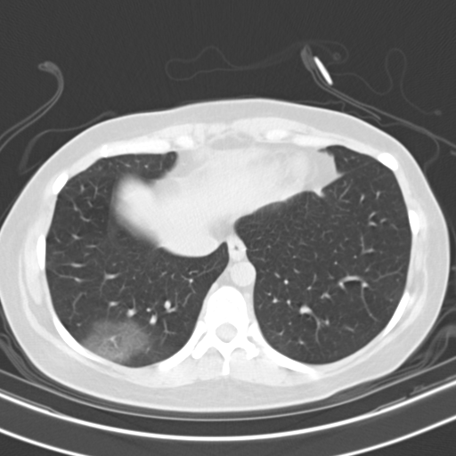

# CT classification

Status: In progress

The objective of this build is to design an algorithm that can **classify** a **CT image** into different types of **pneumonia**. Additionally, the algorithm needs to **segment** the **CT image** to highlight the location of the infection. 

# Defining inputs and outputs

The input (to be classified): As seen on the right, the input is a CT slice of a patient’s lung. it gives an axial CT view, from where the classification is meant to be done.

<aside>
💡

In the dataset, multiple images are obtained from the same patient. This can be used to build a **volumetric model** later on.

</aside>

**Note**: The bounding boxes give the region of the image that is important(`image = image[bbox[1]:bbox[3], bbox[0]:bbox[2]]`)



The classes: 

- Normal
- Pneumonia [or Community-acquired pneumonia (**CAP**)]
- COVID-19

# Building the model

## Data collection

The data will be from the COVIDx CT-3 Dataset described in https://arxiv.org/abs/2206.03043. accessible at https://www.kaggle.com/datasets/hgunraj/covidxct/data. This data is suitable for the segmentation model.

The Kaggle dataset brings together data from a wide range of sources and has been open-sourced to encourage research on the topic.

## Data processing

First work on the **classification** model before doing the **segmentation** model.

The following are the steps for the classification model:

1. Associate each image with its label
2. Standardise the pixel values to fall between 0 and 1 greyscale
3. Adjust the picture according to the bounding boxes
4. Standardise image size to `x by y` ensuring that the salient features of each image are still captured

Ensure a good data mix up the dataset as follows:

<aside>
💡

Process the dataset after the neural network has been set up: together with the `model.fit` block.

</aside>

1. Split the `metadata.csv` into 3 tables: one for each of the three classes
2. Randomise the order of each table
3. Read the nth row of each table and get the pictures associated to the patient id
4. Search for the image path using the text file
5. Add the processed image and label to `x_list` and `y_list` respectively.
6. Do a test, train and validation split 
7. Limit the rows searched by `batch_size`

## Model building

**Classification**

A wide variety of models can be implemented. There are two ideological approaches using which this problem can be tackled:

- Large CNN
    - Less engineering required
    - More computational power needed
- Use a lighter but more specific model engineered to the requirements of the task
    - Requires a more in depth study of the nature of the classification to be done

First, implement a **vanilla CNN** model to better understand the challenges of the problems at hand. Then engineer it with more sophisticated features to achieve better results. 

The actual first iteration implementation involves an innovation to CNN training. Due to the limited size of the training set.

**Segmentation** 

The baseline model will be built using a U-Net. This is a supervised learning approach.

An unsupervised learning approach will be attempted:

1. The image will be broken up into a 16 by 16 grid.
2. Each box will be blacked out in turn
3. The images produced will be fed into the neural network
4. The increases in the diagnosed class will be noted for each image
5. A mask will be produced, predicting the probability of each region being the infected region

## Post-build: model evaluation

Confusion matrix: **`sklearn.metrics.confusion_matrix`**

Calculate Precision, Recall and Accuracy: **`sklearn.**metrics` (the docs elaborate the metrics)

Possible future developments:

- Use a 3D stack to perform classification to enable more data to be seen
- Use a more specific algorithm for classification rather than just a generic CNN
- Use a U-Net for highlight infected regions

# *Continue Mission* - Pneumonia Severity

**Goal:** Deduce a method to determine the severity of the infection (COVID-19 or pneumonia) in addition to just classification.

**Approach:**

If we can get a regressor to determine the percentage of infection, we can map this onto the characteristics of the infection.

The difficulty lies in designing a regressor to work with image data. 

General regression model can be used with a neural network with one output which is either linear or sigmoid. This approach should be the best blanket technique.


The main problem to be solved is to avoid the model from predicting the mean of y values all the time. Possible options available:

- Larger Neural Network
- Mean Squared Log-scaled Error Loss

## Data collection

The following datasets are earmarked for having data about the severity of pneumonia:

- **COVID-CT-MD**
    
    Link to dataset: https://springernature.figshare.com/articles/dataset/COVID-CT-MD_COVID-19_Computed_Tomography_Scan_Dataset_Applicable_in_Machine_Learning_and_Deep_Learning/12991592?file=26069987
    
    Severity measure: Clinical data is presented in "Clinical-data.csv” which including symptoms, characteristics, patient history, and RT-PCR outcome if available
    
    Possible points of concern:
    
    - The dataset is 10 GB (⚠️ too large to be downloaded)
    - Images are stored in DICOM format
    
    Info about the dataset can be obtained at https://www.nature.com/articles/s41597-021-00900-3.
    
- **COVID-19 CT Segmentation Dataset**
    
    Comprising 40 CT scans with 100 annotated slices, this dataset focuses on segmentation tasks, which are crucial for identifying infected regions and determining infection severity.
    
    [PubMed Central](https://pmc.ncbi.nlm.nih.gov/articles/PMC8468956/?utm_source=chatgpt.com)
    
- **COVID-19-CT-Seg-Benchmark Dataset**
    
    Containing 20 COVID-19 CT scans with 1,800 slices, including 300 infected slices, this dataset is valuable for segmentation and severity assessment tasks.
    
    [PubMed Central](https://pmc.ncbi.nlm.nih.gov/articles/PMC8468956/?utm_source=chatgpt.com)
    
- **COVID-19 Percentage Estimation Dataset**
    
    This dataset provides 183 CT scans with slice-level annotations estimating the percentage of lung infection, aiding in quantifying infection severity.
    
    [PubMed Central](https://pmc.ncbi.nlm.nih.gov/articles/PMC8468956/?utm_source=chatgpt.com)
    
- **SARS-CoV-2 CT-Scan Dataset**:
    
    Containing 1,252 CT scan images from COVID-19 patients and 1,230 images from non-infected individuals, this dataset can be used for classification and severity assessment tasks.
    
    [Frontiers in](https://www.frontiersin.org/articles/10.3389/fmicb.2022.995323/full?utm_source=chatgpt.com)
    
- **COVID-CT Dataset**
    
    This dataset includes 349 COVID-19 positive CT images from 216 patients and 463 non-COVID-19 CT images, useful for training models to distinguish between COVID-19 and other conditions.
    
    [ResearchGate](https://www.researchgate.net/publication/340331511_COVID-CT-Dataset_A_CT_Scan_Dataset_about_COVID-19?utm_source=chatgpt.com)
    
- **HRCTCov19 Dataset**
    
    Offering 181,106 high-resolution chest CT images from 395 patients, this dataset includes labels for Ground Glass Opacity, Crazy Paving, Air Space Consolidation, and Negative cases, facilitating detailed analysis of infection severity.
    
    [ArXiv](https://arxiv.org/abs/2205.03408?utm_source=chatgpt.com)
    
- **COVID-19 Severity Assessment Dataset**
    
    This dataset includes CT scans with severity labels, enabling the development of models that can classify the severity levels of COVID-19 infections.
    
    [ArXiv](https://arxiv.org/abs/2205.13774?utm_source=chatgpt.com)
    

## Post-build: model evaluation

The following metrics will be used to evaluate the model:

- **sklearn.metrics.root_mean_squared_error** - RMS of the deviation from the actual value
- **sklearn.metrics.r2_score** - gives the coefficient of determination (regression score function)

# Additional References

https://pmc.ncbi.nlm.nih.gov/articles/PMC8085195/

https://data.mendeley.com/datasets/3y55vgckg6/1

https://github.com/ShahinSHH/COVID-CT-MD

https://github.com/haydengunraj/COVIDNet-CT/tree/master - this is a sample model for the CT problem using the CT-3 dataset

# Progress report

<aside>
💡

This section is to be removed later.

</aside>

For the classification model, the highest validation accuracy achieved on the training set was `0.95455`.

The following are the metrics for the test set:

```
Accuracy: 0.8723404255319149
Precision: 0.8784981226533166
Recall: 0.8723404255319149
AUC: 0.9308367816770261
```


The file of weights in the local directory corresponds to these results.

For the severity identification model, the best scores yielded so far are as follows:

```
The model yielded
r2 score: 0.801916712367247
mse score: 12.321733274800428
loss: 7.047403323769868
```